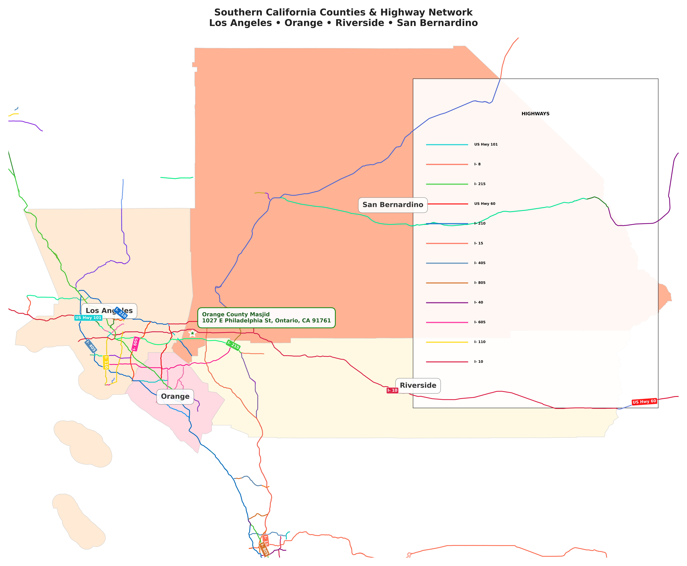

# Southern California Counties & Masjid Map Generator

A Python application for generating high-resolution maps of Southern California counties with highway networks and masjid location, featuring unique highway colors and professional legend for easy identification.



## 🗺️ Features

- **4 Southern California Counties**: Los Angeles (peach), Orange (coral), Riverside (yellow), San Bernardino (salmon)
- **Unique Highway Colors**: 24 distinct colors for easy highway identification
- **Professional Legend**: Highway names with matching color samples
- **Single Masjid Location**: Orange County Masjid at 1027 E Philadelphia St, Ontario, CA 91761
- **High-Quality Output**: 300 DPI suitable for large-format printing (24" × 24")

## 🚀 Quick Start

```bash
# Clone the repository
git clone https://github.com/iHusain/socal-masjid-map.git
cd socal-masjid-map

# Create virtual environment
python -m venv venv
source venv/bin/activate  # On Windows: venv\Scripts\activate

# Install dependencies
pip install -r requirements.txt

# Download TIGER/Line shapefiles (required)
python download_data.py

# Generate the map
python socal_map.py
```

## 📥 Data Requirements

This project uses US Census TIGER/Line 2023 shapefiles:
- **Counties**: `tl_2023_us_county.shp` (~125 MB)
- **Primary Roads**: `tl_2023_us_primaryroads.shp` (~55 MB)

**Important**: Run `python download_data.py` before generating maps. This downloads the required shapefiles from the US Census Bureau.

## 📊 Output

The application generates:
- **PNG**: `us_masjid_map_final.png` (~1.5 MB) - High-resolution raster
- **PDF**: `us_masjid_map_final.pdf` (~0.4 MB) - Vector format for printing

Files are saved to the `output/` directory.

## 🎨 Visual Elements

### County Colors
- **Los Angeles**: Light peach (#FFE5CC)
- **Orange**: Soft coral (#FFD1DC)  
- **Riverside**: Pale yellow (#FFF8DC)
- **San Bernardino**: Light salmon (#FFA07A)

### Highway System
- **24 Unique Colors**: Each highway has distinct color for easy identification
- **Professional Legend**: Shows highway names with matching color samples
- **Complete Network**: 532 highway segments with major route labeling
- **Aligned Labels**: Text rotated to match highway direction

## 🛠️ Technical Specifications

### Data Sources
- **Counties**: US Census TIGER/Line 2023 shapefiles
- **Highways**: US Census TIGER/Line Primary Roads 2023
- **Coordinate System**: WGS84 (EPSG:4326)

### Requirements
- Python 3.8+
- Dependencies: geopandas, matplotlib, shapely, pandas, numpy
- System: ~4GB RAM recommended for processing

## ⚙️ Configuration

### Customize Masjid Location
```python
MASJID = {
    "name": "Your Masjid Name",
    "latitude": 34.0633,
    "longitude": -117.6509,
    "address": "Your Address"
}
```

### Modify Target Counties
```python
TARGET_COUNTIES = ["Los Angeles", "Orange", "Riverside", "San Bernardino"]
```

### Adjust Output Settings
```python
MAP_WIDTH_INCHES = 24    # Output width
MAP_HEIGHT_INCHES = 24   # Output height  
DPI = 300               # Print resolution
```

## 🧪 Development

### Run Tests
```bash
pytest  # 15 tests passing
```

### Code Quality
```bash
black socal_map.py      # Format code
flake8 socal_map.py     # Lint code
```

## 📁 Project Structure

```
socal-masjid-map/
├── socal_map.py           # Main application
├── data/shapefiles/       # TIGER/Line datasets (included)
├── output/                # Generated maps
├── assets/                # README images
├── src/                   # Original modular codebase
├── tests/                 # Test suite
├── requirements.txt       # Dependencies
└── README.md             # This file
```

## 🎯 Use Cases

- **Community Outreach**: Visual representation of masjid location
- **Educational Materials**: Geographic reference for Southern California
- **Presentation Graphics**: High-quality maps for reports
- **Print Materials**: Suitable for posters and banners

## 📈 Performance

- **Processing Time**: ~30 seconds for complete generation
- **Memory Usage**: ~2GB during rendering
- **Output Quality**: 300 DPI print-ready
- **File Sizes**: PNG 1.5MB, PDF 0.4MB

## 🤝 Contributing

1. Fork the repository
2. Create feature branch: `git checkout -b feature-name`
3. Make changes and test: `python socal_map.py`
4. Commit: `git commit -m "feat: description"`
5. Push and create pull request

## 📄 License

MIT License - See LICENSE file for details.

## 🔗 Data Attribution

- **US Counties & Highways**: US Census Bureau TIGER/Line Shapefiles 2023
- **Masjid Location**: 1027 E Philadelphia St, Ontario, CA 91761
